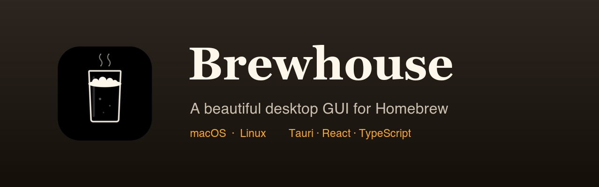
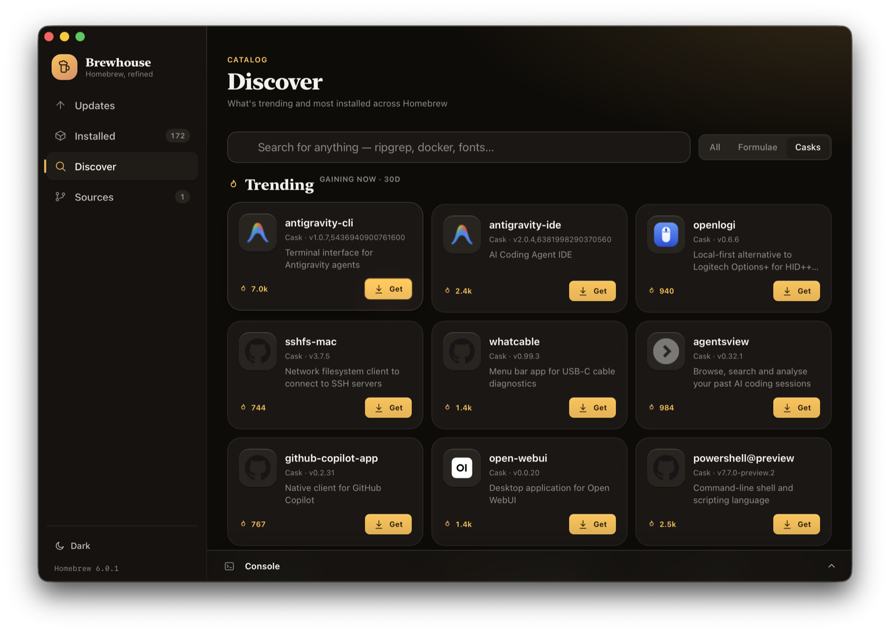

<p align="center">
  
</p>

<h1 align="center">Brewhouse</h1>

<p align="center">
  A beautiful native desktop GUI for <a href="https://brew.sh">Homebrew</a> — update, search, install, and manage formulae, casks, and taps.
</p>

<p align="center">
  <a href="https://github.com/TrueNix/brewhouse-app/actions/workflows/ci.yml"></a>
  <a href="https://github.com/TrueNix/brewhouse-app/actions/workflows/release.yml"></a>
  <a href="LICENSE"></a>
  
  
</p>

> _Amber Atelier_ design language: warm dark-luxury surfaces, glass layering, a honey/amber accent, an editorial serif paired with SF. Light + dark, follows the system appearance.

## Screenshots

<p align="center">
  
</p>

<p align="center"><em>Discover — Trending casks ranked by 30-day install momentum, with real app icons, live install counts, and one-click installs.</em></p>

## Features

- **Updates** — see every outdated formula & cask, upgrade one or all, and refresh Homebrew's metadata (`brew update`).
- **Installed** — browse your whole library with live filtering, pin/unpin, and one-click uninstall or upgrade.
- **Discover** — instant search across the full Homebrew catalog (cached locally from formulae.brew.sh) for formulae and casks.
- **Sources** — list, add, and remove taps (third-party repositories).
- **Live console** — long-running `brew` commands stream their output into a collapsible console drawer in real time.
- **Detail drawer** — descriptions, versions, dependencies, license, homepage, and caveats for any package.

## Download

Grab the latest build from the [**Releases**](https://github.com/TrueNix/brewhouse-app/releases) page.

Download the **`.dmg`** (universal: Apple Silicon + Intel). Builds are **unsigned**,
so on first launch right-click the app and choose **Open**, or run:

```bash
xattr -dr com.apple.quarantine /Applications/Brewhouse.app
```

## Develop

```bash
npm install
npm run app          # tauri dev — launches the desktop window with HMR
```

## Build

```bash
npm run app:build    # produces a .app bundle + .dmg in src-tauri/target/release/bundle
```

## Releasing

Releases are built automatically by GitHub Actions. To cut one:

```bash
# bump the version in package.json + src-tauri/tauri.conf.json, then:
git tag v0.1.0
git push origin v0.1.0
```

The [`Release`](.github/workflows/release.yml) workflow builds the macOS (universal)
app and attaches the `.dmg` to a **draft** GitHub Release for you to review and
publish. You can also trigger it manually from the **Actions** tab.

## Architecture

```
src/                 React + TypeScript frontend
  lib/               types + Tauri command bridge (api.ts)
  hooks/             theme, async resource, package actions
  data/              shared brew-data provider (installed/outdated/taps/status)
  jobs/              streaming job/console state
  components/        ui primitives, shell (sidebar/console), package rows + drawer
  views/             Updates · Installed · Discover · Sources
src-tauri/           Rust backend
  src/brew.rs        locate brew, run it, parse JSON, stream jobs as events
  src/catalog.rs     fetch/cache/search the formulae.brew.sh catalog
  src/lib.rs         Tauri command layer + app state
  src/models.rs      DTOs (camelCase) mirrored in src/lib/types.ts
```

The backend never invokes a shell: every `brew` call uses argument vectors, package
names are validated against a strict allow-list, and `open_url` only accepts `http(s)`.

## Requirements

- macOS with [Homebrew](https://brew.sh) installed (Apple Silicon or Intel)
- Node 18+ and a Rust toolchain (for building)

## License

[MIT](LICENSE) © 2026 TrueNix
